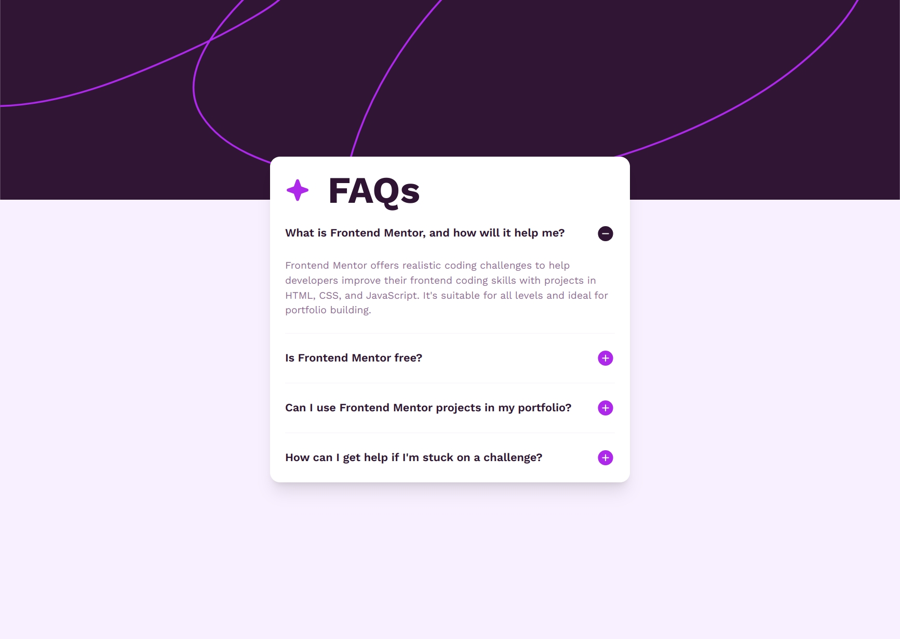
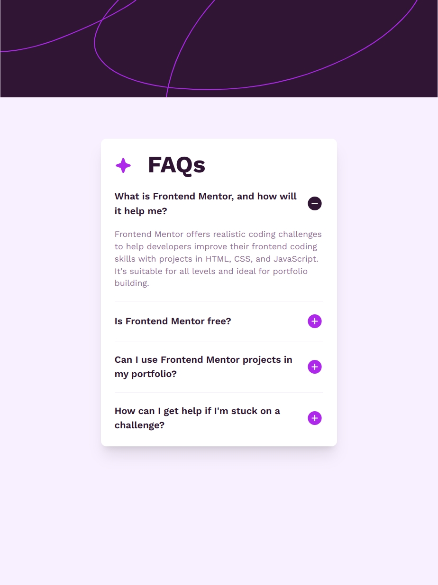
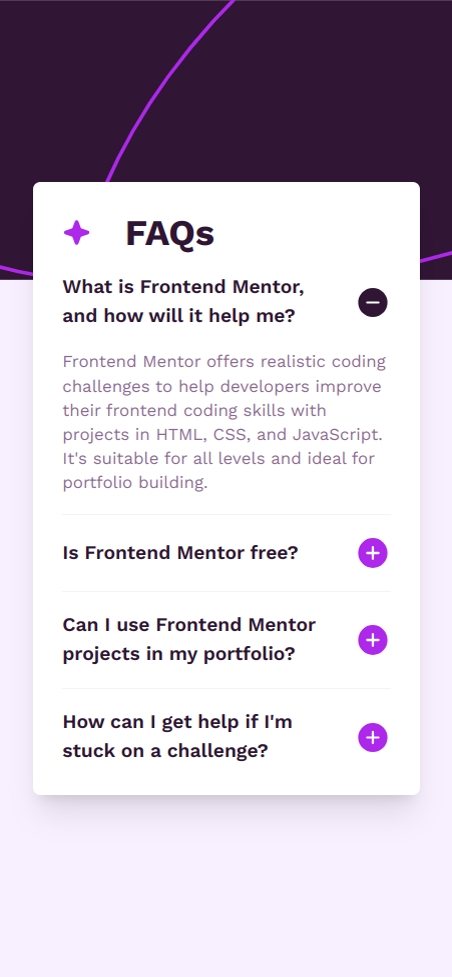

# Frontend Mentor - FAQ accordion solution

This is a solution to the [FAQ accordion challenge on Frontend Mentor](https://www.frontendmentor.io/challenges/faq-accordion-wyfFdeBwBz). Frontend Mentor challenges help you improve your coding skills by building realistic projects.

## Table of contents

- [Frontend Mentor - FAQ accordion solution](#frontend-mentor---faq-accordion-solution)
  - [Table of contents](#table-of-contents)
  - [Overview](#overview)
    - [The challenge](#the-challenge)
    - [Screenshot](#screenshot)
    - [Links](#links)
  - [My process](#my-process)
    - [Built with](#built-with)
    - [What I learned](#what-i-learned)
  - [Author](#author)

## Overview

### The challenge

Users should be able to:

- Hide/Show the answer to a question when the question is clicked
- Navigate the questions and hide/show answers using keyboard navigation alone
- View the optimal layout for the interface depending on their device's screen size
- See hover and focus states for all interactive elements on the page

### Screenshot





### Links

- Solution URL: [GitHub](https://github.com/Adamskiee/accessible-faq-accordion)
- Live Site URL: [Live Site URL](https://adamskiee.github.io/accessible-faq-accordion)

## My process

### Built with

- Semantic HTML5 markup
- CSS custom properties
- Flexbox
- CSS Grid
- Mobile-first workflow
- [Tailwind](https://tailwindcss.com/) - CSS Frameworks
- [Fluid Tailwind](https://fluid.tw/) - For better responsive design

### What I learned

- Fluid Tailwind

```css
.container {
    @apply bg-white px-6 py-6 flex flex-col shadow-xl ~mobile/desktop:~rounded-md/2xl ~mobile/desktop:~max-w-xs/xl;
  }
```

- Dynamically assign attributes for accessibility

```js
updateAttributes() {
    this.elements.articles.forEach((article, i) => {
        const btn = article.querySelector(".question-btn");
        const question = article.querySelector(".question");
        const answer = article.querySelector(".answer");

        const qId = `question${i + 1}`;
        const aId = `answer${i + 1}`;

        question.id = qId;
        answer.id = aId;

        btn.setAttribute("aria-controls", aId);
        answer.setAttribute("aria-labelledby", qId);
        answer.setAttribute("aria-live", "polite");
    });
}
```

- Keyboard Navigation

```js
questionBtns.forEach((btn, index) => {
    btn.addEventListener("keydown", (e) => {
    let newIndex;

    switch (e.key) {
        case "ArrowDown":
        newIndex = (index + 1) % questionBtns.length;
        questionBtns[newIndex].focus();
        console.log("arrowdown");
        break;

        case "ArrowUp":
        newIndex = (index - 1 + questionBtns.length) % questionBtns.length;
        console.log("arrowup");
        questionBtns[newIndex].focus();
        break;

        case "Home":
        questionBtns[0].focus();
        break;

        case "End":
        questionBtns[questionBtns.length - 1].focus();
        break;
    }
    });
});
```

## Author

- Frontend Mentor - [@Adamskiee](https://www.frontendmentor.io/profile/Adamskiee)
